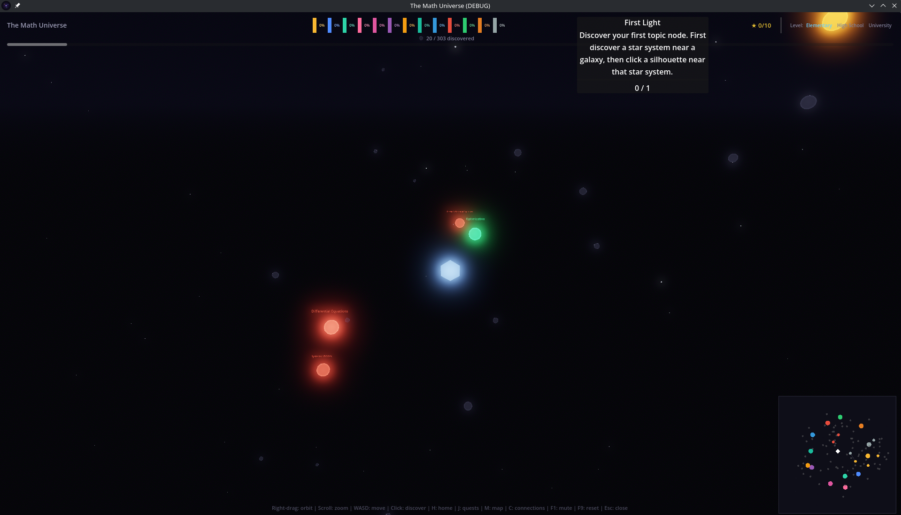
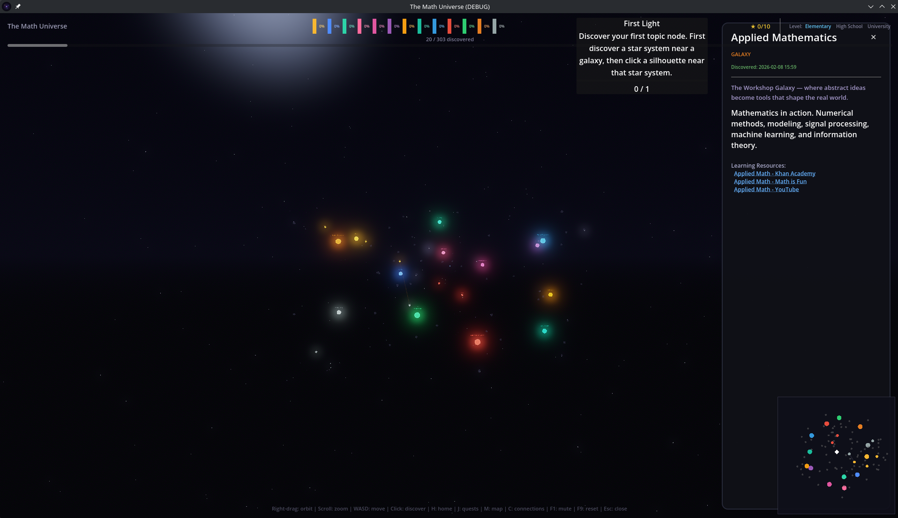
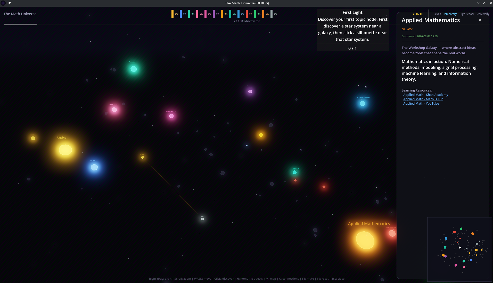

# The Math Universe

A co-op 3D space exploration game where all of mathematics is a universe to discover. Mathematical domains are galaxies, subdomains are star systems, and individual topics are planets — **303 nodes** across **13 domains** connected by a force-directed 3D layout.

Built with [Godot 4.6](https://godotengine.org/) using pure GDScript. Runs natively on desktop and in the browser via WebAssembly.

**[Play the live demo](https://timwinkler.github.io/TheMathUniverse/)**


## Screenshots

| Universe Overview | Info Panel with Learning Resources | Zoomed In with Connections |
|---|---|---|
|  |  |  |

## Features

- **13 mathematical galaxies** — Algebra, Analysis, Geometry, Number Theory, Probability, Topology, Combinatorics, Logic, Discrete Math, Differential Equations, Optimization, Applied Math, Category Theory
- **Force-directed 3D layout** with glow shaders and a starfield background
- **Discovery system** — explore by clicking adjacent nodes to reveal the universe, with fog of war
- **Quest system** — 18 quests across 3 chains and 6 standalone challenges
- **10 achievements** — from First Contact to Universal Mind
- **Co-op multiplayer** — 2-10 players via WebSocket, shared discovery
- **Minimap** with click-to-fly navigation
- **Learning resources** — curated links to Khan Academy, Wikipedia, MIT OCW, Brilliant, and more, filtered by difficulty level
- **Save system** — auto-saves progress (IndexedDB on web, local file on desktop)
- **Web export** — plays directly in the browser, no install needed

## Controls

| Key | Action |
|-----|--------|
| **WASD** | Move ship / pan camera |
| **Right-drag** | Orbit camera |
| **Scroll** | Zoom in/out |
| **Click** | Discover adjacent node |
| **H** | Fly to home position |
| **J** | Open quest log |
| **M** | Toggle minimap |
| **C** | Toggle all connections |
| **F1** | Toggle mute |
| **F9** | Reset all progress |
| **Esc** | Close panels |

## Play in Browser

### From a pre-built export

Serve the `build/web/` directory with any HTTP server:

```bash
cd build/web
python3 -m http.server 8000
```

Then open http://localhost:8000 in your browser.

### Build the web export yourself

1. **Install Godot 4.6** — download from [godotengine.org](https://godotengine.org/download)

2. **Install export templates** — download `Godot_v4.6-stable_export_templates.tpz` from [GitHub releases](https://github.com/godotengine/godot/releases/tag/4.6-stable) and extract:

   ```bash
   mkdir -p ~/.local/share/godot/export_templates/4.6.stable
   unzip Godot_v4.6-stable_export_templates.tpz -d /tmp/templates
   cp /tmp/templates/templates/* ~/.local/share/godot/export_templates/4.6.stable/
   ```

3. **Create the export preset** (if `export_presets.cfg` doesn't exist) — open the project in the Godot editor, go to **Project > Export**, add a **Web** preset, disable **Thread Support**, then close the editor.

4. **Export**:

   ```bash
   mkdir -p build/web
   godot --headless --export-release "Web" build/web/index.html
   ```

5. **Serve and play**:

   ```bash
   python3 -m http.server 8000 -d build/web
   ```

No special server headers (COOP/COEP) are required since thread support is disabled.

## Docker

Build and run the web export in a container:

```bash
docker build -t math-universe .
docker run -d -p 8080:80 --name math-universe math-universe
```

Then open http://localhost:8080 in your browser.

The image uses nginx:alpine with correct MIME types for `.wasm` and `.pck`, gzip compression, and 7-day cache headers.

## Run in Godot Editor (Desktop)

1. **Install Godot 4.6** from [godotengine.org](https://godotengine.org/download)

2. **Clone the repository**:

   ```bash
   git clone https://github.com/TimWinkler/TheMathUniverse.git
   cd TheMathUniverse
   ```

3. **Open in Godot** — launch Godot, click **Import**, select the `project.godot` file

4. **Run** — press **F5** or click the play button. The game starts at the lobby screen — click **Play Solo** to explore.

## Project Structure

```
TheMathUniverse/
├── data/                    # JSON data files
│   ├── domains.json         # Domain definitions and cross-domain edges
│   ├── quests.json          # Quest chains and standalone quests
│   ├── resources.json       # Learning resource links for all 303 nodes
│   ├── algebra.json         # 13 domain data files with subdomains/topics
│   ├── analysis.json
│   └── ...
├── tools/
│   └── generate_resources.py  # Generates resources.json from domain data
├── scripts/
│   ├── data/                # Data loading (DataLoader autoload)
│   ├── game/                # Core systems (autoloads)
│   │   ├── discovery_manager.gd
│   │   ├── save_manager.gd
│   │   ├── achievements.gd
│   │   ├── quest_manager.gd
│   │   └── audio_manager.gd
│   ├── universe/            # 3D scene management
│   │   ├── universe_manager.gd
│   │   ├── force_layout.gd
│   │   ├── node_base.gd
│   │   ├── camera_controller.gd
│   │   └── connection_line.gd
│   ├── player/              # Player ship
│   ├── multiplayer/         # WebSocket networking
│   └── ui/                  # All UI components
├── scenes/                  # Godot scene files (.tscn)
├── shaders/                 # Star glow and starfield shaders
└── assets/audio/            # Music and SFX (optional, graceful fallback)
```

## Multiplayer

From the lobby screen:

1. One player clicks **Host Game** to start a server
2. Other players enter the host's IP address and click **Join Game**
3. The host clicks **Start Game** when all players have joined

Discoveries are shared across all players in real-time.

## License

This project is licensed under the [GNU General Public License v3.0](LICENSE).
